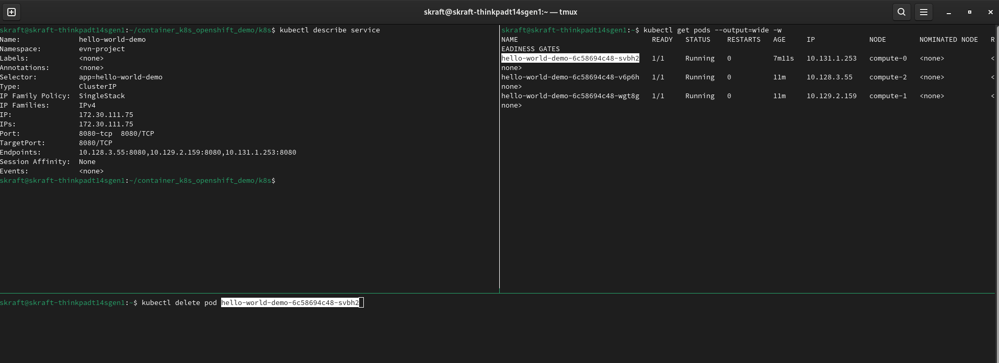
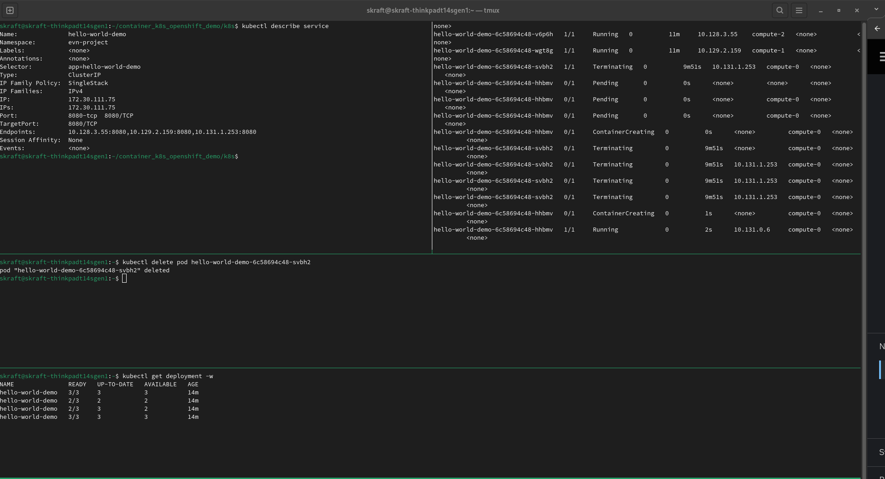

# Show the basic capabilities of Kubernetes

1. Connect to a Kubernetes cluster:
In our case we are using OpenShift, but all what can be done with Kubernetes is also supported with OpenShift

2. Set the right context aka *Namespace* or *Project*:  
- Create the environment: `kubectl create namespace [Project Name]`
- Change the current-context: `kubectl config set-context --current --namespace [Project Name]`
- Check that we are in the right environment: `kubectl config current-context`

> **_NOTE:_**  Please note that the context name is kept the same, although you are pointing to a different project. This might be somehow misleading!!

3. Create resources declaratively:
Kubernetes primarily works with so-called *Manifests*. These are config-files which specify the **desired** state. It's then the obligation of Kubernetes to continously compare the *desired* with the *real* status and initiate remediation. 

> **_NOTE:_** This is a key differentiator to Virtual Machines where declarations are only valid for the creation, but there is no continous reconciliation!!

Let's just deploy the image first.

- Have a look at a simple yaml

- Deyploying the image: `kubectl apply -f deployment-1-replica.yaml`

> **_NOTE:_** Alternatively, you could also use the CLI-command to generate a yaml-file, e.g. `kubectl create deployment hello-world-demo --image=quay.io/stephan-kraft/hello-world-demo --replicas=3`

- Let's see whether instances have already been started: 

`kubectl get deploy` and `kubectl get pods`

Now, let's show the beauty of *declarative configuration*:

First, by just changing the configuration, e.g. to have more replicas.
`kubectl apply -f deployment-8-replica.yaml`

Second, by killing any of the instances ("pods") and see what happens.
- `kubectl get pods`

- Copy one of the pods id

- `kubectl delete pod [pod id]`

- Now, show again the state of the deployment and all instances. Obviously, the remediation has happened automatically and very fast. The only thing how you can notice is that one of the pods has a lower age.

But, how does this actually work for external consumers. They would not like to access the pods directly per IP-adress. This is where Services come into play:
- They have stable IPs
- They "collect" their member pods automatically via label matching.

For this, let's deploy a simple service:
`kubectl apply -f service.yaml`

If you describe the service, you can see that it gets automatically an IP-adress and manages several so-called end-points. This are all the pods that match the "selector" of the service.

Let's now see what happens if we kill a pod. 

That's pretty cool. K8s not only automatically creates a new pod, but also manages to exclude / include these pods in the service. Thus, consumers of the service would not even notice that the pod has been replaced. (Of course, this only applies to a stateless architecture!)

But, could we now access the pods? Let's try to do a curl: `curl [Service IP]:8080`. 

No, that doesn't work. So, we need to do something additionally to get it externally exposed. That's where also OpenShift will offer a smarter solution.

> **_NOTE:_** You could test it out, by running the command from within a pod, e.g. `kubectl exec [pod id] -- curl [service ip]:8080`

Let's explore some advanced features from K8s:
- rule-based placement:
We have a Kubernetes cluster with 3 worker nodes. How does Kubernetes decide where to put the instances? Well, that's based on several rules.
`kubectl get pods --output=wide`

- Anti-affinity rules:
`kubectl apply -f deployment-with-anti-affinity.yaml`

- Readiness checks

- Requests and Limits

Great, that has worked. But there are still some challenges that we have not adressed:

- How can we expose these pods to the outside world?

- How are actually the images built?

- And then, we actually need a lot of other services to complement the Kubernetes cluster, e.g. image registry, monitoring, an overlay network, etc

With OpenShift all of these issues are solved in an *opinionated* way. Still, with OpenShift everything is open source. 

Source: [Kubernetes Tutorial @ Red Hat Developer Page](https://redhat-scholars.github.io/kubernetes-tutorial/kubernetes-tutorial/kubectl.html)

