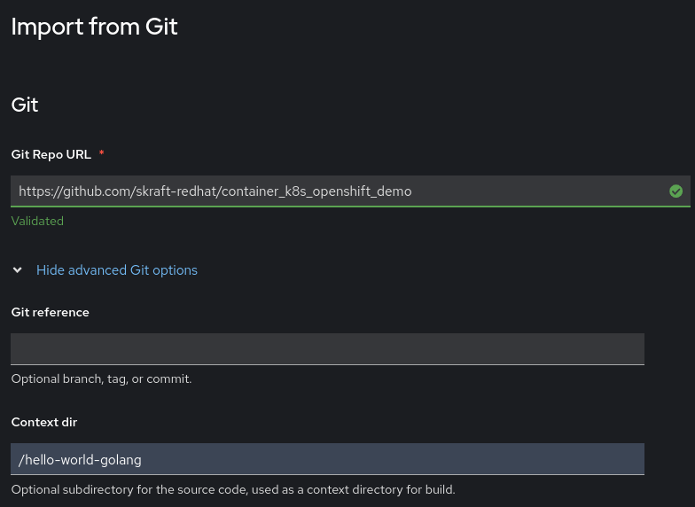
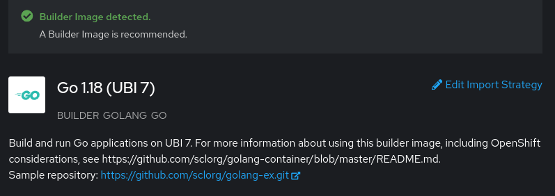

# OpenShift Capabilities

1. First let's introduce the GUI which makes the whole administration as well as the developer workflows much easier and more transparent

2. Comfortably, we can build on the deploments that we have made before with basic Kubernetes. Let's have a look at them.

3. One of the issues with plain K8s is that exposing workloads is not that straight-forward. Let's see how this would have worked with OpenShift.

- Click on "+Add" in the Developer perspective and choose "Container Images"

- You just need to provide the image repository and all the necessary manifests, including the ones required to expose the service externally will be created.

Now, we can explore several things:
- All the YAML Files that have been automatically generated
- easily scale up and down
- show load-balancing
- show an upgrade:   
    Just go to the Deployment and choose "Actions -> Edit hello-world-demo"

    > **_NOTE: It might be that you get an error message stating that you have to apply it to the latest version. In that case, just press on "Save" again and it should work!_**

## Supporting the build life-cycle phase

Let's show how OpenShift can support the whole life-cycle, literally from the Source-code

In fact, the process from a source (git) to a deployed image involves several tasks:
- Building the source to executables (e.g. mvn package)
- Choosing a base image
- Providing a Dockerfile / Containerfile
- Providing multiple Kubernetes manifests

All these steps usually require tooling which needs to be maintained. With OpenShift, the whole environment is captured in a container image, the so-called *Builder image*. Comfortably, OpenShift is packaged with builder images for the most common programming languages and frameworks.

**Let's explore this with Go.**

In our git repository, we have a very simple Go-application in the folder */hello-world-golang*.

If we want to have this deployed as a container, we would need to follow the above steps. Namely, first having a go compiler, then writing a Dockerfile, then building the container image, then writing Kubernetes manifests and then applying them to the cluster.

In OpenShift, this is much, much easier.

In the "Developer" perspective, click on "+Add" and choose the option "Import from Git". Then provide the Git Repository and the rest will be chosen and created automatically.

As you can see, OpenShift is smart enough to automatically choose the right Builder Image. Which is in our case Go 1.18 based on the Universal Base Image 7 (= free distribution of Red Hat Enterprise Linux 7).

Example:
- Git-Repo URL: https://github.com/skraft-redhat/container_k8s_openshift_demo

- Context Dir: hello-world-golang

(Remark: The unauthenticated access to the GitHub API may be limited. If this is the case you need to create a secret to access it authenticated. This can be done in the "+Add" form by expanding the "Advanced Git options" and selecting/creating a "Source Secret")

Now, if you start this (by presssing "Create"), several things will happen:

- The Builder Image will be instantiated and will take care of building the application and the container image
- All the Manifests will be created (deployment, service, route)
- Once the build is finished, it will be automatically deployed

> **_ATTENTION:_** In v4.16 of OpenShift there is a bug, that removes the *Automatic deploying of a new version* if editing the Deployment in the Web Console. See: https://issues.redhat.com/browse/OCPBUGS-36339
Great!!! But what about upgrades?

## Automatic deployment from commit

The support for building container images goes beyond the one-time creation. If we are updating the source code, OpenShift provides a fully automated solution to run through the whole process again.

The only thing, we need to do is to connect the GitHub repository with the OpenShift BuildConfig. This is accomplished, by adding a WebHook to Git which is triggered by each commit. The WebHook will then iniate the OpenShift Build.

1. Get the URL of the "Start Trigger"

    - In the "Admin" perspective, go to "Builds -> BuildConfigs"

    - Select the BuildConfig object that was automatically created for the Go application.

    - Scroll down and copy the **Generic WebHook** URL with Secret

2. Create the Webhook

    - In the GitHub repository, go to Settings -> Webhooks

    - Fill out the form

        Payload URL: The copied URL from OpenShift

        Content Type: application/json

        SSL Verification: Disable

3. Now, you can change the source code and push it to the git repo.

4. You should see that a new build has been automatically created (e.g. look in the topology view or show the new build object). After the build has finished a new version is deployed.

One last thing that we want to show is one of the sweet spots of Kubernetes / OpenShift, which is smooth upgrading of applications. This actually allows to have multipe upgrades during business hours and generally reducing the risk.

The concepts for this are:
- Canary deployments: only upgrading a small portion (e.g. 10%) to test a new version 
- Blue/Green Deployments: having multiple versions of an application running simultaneously. 

The easiest to show are rolling upgrades.

- Scale up the number of replicas to any number above 1.

- Explain the different parameter to configure the rolling upgrade (Max unavaible, Max surge)

- Start another upgrade as described above

- Watch how K8s performs the upgrade 